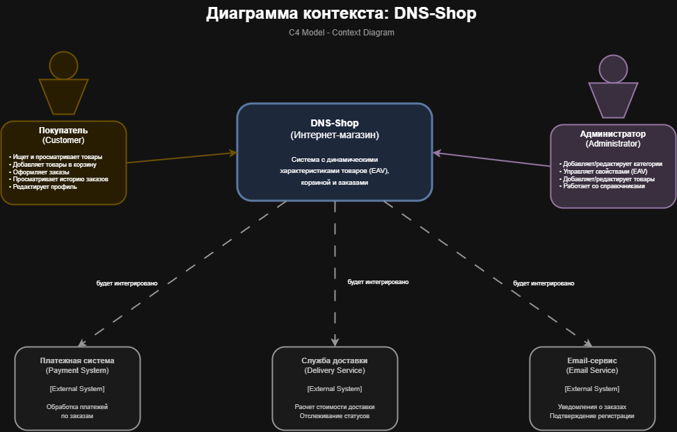
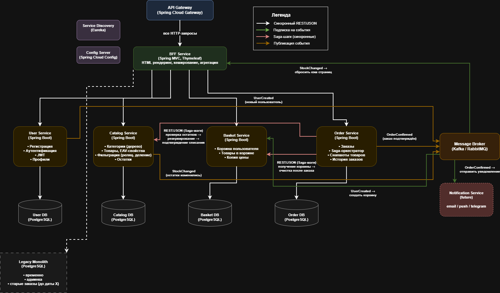

# Архитектурный анализ для DNS-Shop

* ### [Out of scope - определить границы MVP](#oos-p)
* ### [Какие будут микросервисы](#micr-p)
* ### [Какие сущности будут](#table-p)
* ### [Какие бизнес-операции выделяются](#business-p)
* ### [Какие REST эндпоинты](#rest-p)
* ### [Какая бд](#bd-p)
* ### [С4 (первые 3 уровня вышеописанной системы)](#c4-p)

## <a id="oos-p">Out of scope (границы MVP)</a> 
  
В монолите на первую итерацию оставляем:

1. Админка (управление каталогом, свойствами, справочниками):
   * Низкая нагрузка
   * Сложная логика (EAV)
   * Меньше рисков при падении

2. Старые заказы (до даты X)

   * В реальности это большой объем данных (миллионы записей) затрудняющий миграции.
   * Связанные сущности (заказы ссылаются на товары для получения цены, в микросерввисах целстность не сохраняется и ссылки могут потеряться)

3. Аналитика (подсчет количества товаров в фильтрах)

 * Некритична для пользователя

4. Кэширование (Hibernate 2nd level cache)

   * Ehcache не работает в распределенной среде
   * Потребуется Redis (отдельная задача)

5. Интеграции (платежи, доставка)
   * Не реализованы в текущей версии

## <a id="micr-p">Микросервисы (по доменам)</a>

### Применяю подход по доменам:

> Мини монолиты. Проще в разработке, не нужно мельчить, подымать дополнительную инфраструктуру.
Связанный функционал и данные сгруппированы по границам ответственности, в одном месте.
Меньше распределенных транзакций и сетевых вызовов. 

1. BFF Service (Backend for Frontend)

Ответственность:
   * Все Thymeleaf-контроллеры
   * Сессии пользователей

Особенность:
   * Нужен всем для генирации HTML-шаблонов и REST запросов к микросервисам.

2. User Service

Ответственность:
  * Регистрация/логин
  * Профиль пользователя
  * JWT аутентификация

Особенность:
   * Нужен всем для авторизации

3. Catalog Service

Ответственность: 
  * Категории (дерево, CTE)
  * Товары (CRUD)
  * EAV-свойства
  * Фильтрация (реляционное деление)
  * Остатки (product.count)

Особенность:
   * Много чтения, можно кешировать

4. Basket Service

Ответственность:
   * Временное хранение товаров пользователя перед заказом

Особенность:
   * Много записи, данные нужны лишь на время, можно использовать Redis

5. Order Service

Ответственность:
* Оформление заказов, проверка остатков, история заказов

Особенность:
* Критичная бизнес-логика, конкурентный доступ, транзакции, общение с каталогом и корзиной.

6. Вспомогательные (не реализованы, возможно в будущем)

   * Payment Service (платежи)
   * Notification Service (уведомления)
   * Delivery Service (доставка)

## <a id="table-p">Сущности по сервисам</a>

**User Service**
- `users` (id, email, password, role)
- `user_profile` (user_id, name, surname, phone, birth_date)

**Catalog Service**
- `category` (id, parent_id, name, image)
- `producer` (id, name)
- `product` (id, code, model, price, count, reserved, category_id, producer_id, image)
- `property` (id, name, category_id, unit, dtype)
- `product_property` (id, product_id, property_id, number_value, float_value, string_classifier_id)
- `string_classifier` (id, name, property_id)

**Basket Service**
- `basket` (id, user_id, sum, count)
- `basket_product` (id, basket_id, product_id, price, count, sum, is_selected)

**Order Service**
- `orders` (id, user_id, status, reservation_id, sum, count, created_at, delivery_address)
- `order_product` (id, order_id, product_id, product_name, product_code, producer_name, price, count, sum)

**BFF Service** — нет БД (только кэш)

## <a id="business-p">Бизнес-операции</a>

**Регистрация**
- User Service → создает пользователя
- → публикует `UserCreated`
- Basket Service → создает корзину

**Аутентификация**
- User Service → проверяет пароль
- → выдает JWT (id, role)

**Добавление в корзину**
- Basket Service → запрашивает цену у Catalog Service (REST)
- → сохраняет `basket_product` с копией цены
- → пересчитывает корзину

**Просмотр каталога**
- Catalog Service → фильтрация (CPredicate + Criteria API)
- → пагинация

**Оформление заказа (Saga)**
1. Order Service → резервирует товары (Catalog: `reserve`)
2. → получает корзину (Basket: `get-for-order`)
3. → создает заказ (статус PENDING)
4. → подтверждает списание (Catalog: `confirm`)
5. → очищает корзину (Basket: `clear`)
6. → подтверждает заказ (статус CONFIRMED)
7. → публикует `OrderConfirmed`
- **Компенсация:** при ошибке → Catalog: `cancel-reservation`, заказ → FAILED

**Отмена заказа**
- Order Service → проверяет статус
- Если PENDING → Catalog: `cancel-reservation`, заказ → CANCELLED

**Просмотр заказов**
- Order Service → поиск по user_id, подгрузка снапшотов

## <a id="rest-p">REST эндпоинты</a>

**User Service** (`/api/v1/users`)
- `POST /register`
- `POST /login`
- `GET /profile`
- `PUT /profile`
- `POST /validate` (для сервисов)

**Catalog Service** (`/api/v1/catalog`)
- `GET /categories`
- `GET /categories/{id}/breadcrumbs`
- `GET /products` (фильтрация, пагинация)
- `GET /products/{id}`
- `GET /categories/{id}/properties`
- `POST /products/check-stock`
- `POST /products/reserve`
- `POST /products/confirm-reservation`
- `POST /products/cancel-reservation`

**Basket Service** (`/api/v1/basket`)
- `GET /`
- `POST /items`
- `PUT /items/{id}`
- `DELETE /items/{id}`
- `PATCH /items/{id}/select`
- `POST /clear`
- `GET /for-order/{basketId}` (internal)

**Order Service** (`/api/v1/orders`)
- `POST /`
- `GET /`
- `GET /{id}`
- `POST /{id}/cancel`
- `GET /status/{orderId}` (internal)

## <a id="bd-p">Базы данных</a>
   
1. User Service
   1. PostgreSQL
      * ACID для регистрации
      * Структурированные данные (свои таблицы, свои типы)

2. Catalog Service

   1. PostgreSQL
      * Сложные связи (JOIN, CTE)
      * EAV-модель
      * Реляционное деление
      * Индексы на category_id, producer_id, property_id

3. Basket Service
   1. PostgreSQL (1 итерация)
      * → упрощение старта

   2. Redis (future)
      * → in-memory скорость
      * → TTL для брошенных корзин

4. Order Service
   1. PostgreSQL
      * ACID для заказов
      * Партиционирование по дате
      * Снапшоты товаров (денормализация)

5. BFF Service
   1. Нет БД (stateless)
   2. Опционально Redis для сессий

## <a id="c4-p">Модель C4 для DNS-Shop</a>

### Уровень C1: Context Diagram

### Уровень C2: Container

### Уровень C3:	Component (Order Service)

