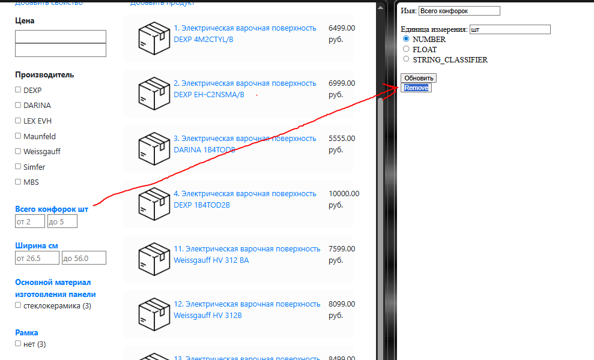
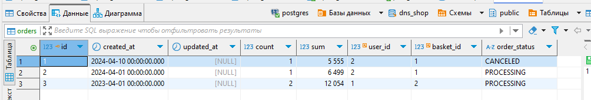
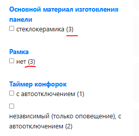
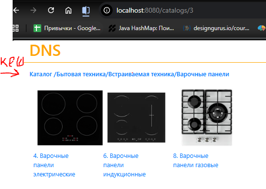

## Out of scope для DNS-Shop (первая итерация)

### 1. Административная панель (оставляем в монолите)

**Почему:**

* Низкая нагрузка (админов мало)
* Меньше рисков — если админка временно упадет, пользователи не пострадают
* Сложная логика (EAV, управление свойствами) — проще оставить как есть на первом этапе

**Что именно:** CRUD категорий, товаров, характеристик.

### 2. История заказов (старые данные остаются в монолите)
  
**Почему:**

* Миграция миллионов заказов — сложная и рискованная
* Новые заказы пойдут в новый сервис, старые — читаем из монолита
* Можно реализовать паттерн "Strangler Fig" — постепенное замещение

**Что именно:** Старые заказы (до даты X) — остаются в БД монолита. Просмотр истории показывает заказы из двух источников (монолит + новый сервис)

### 3. Сложная аналитика (количество товаров в фильтрах)

* Это тяжелые запросы (JDBC + агрегация)
* Не критично для бизнеса (можно отключить временно)
* Требует отдельного решения (возможно, Elasticsearch позже)

**Что именно:** Подсчет количества товаров по каждому значению фильтра

### 4. Кэширование (Hibernate 2nd level cache)

**Почему:**

* В распределенной системе нужен распределенный кэш (Redis), а не Ehcache
* На первом этапе можно обойтись без кэша или с упрощенным решением

**Что именно:** L2 cache на сущностях и запросах (@QueryHints

### 5. Интеграции с внешними системами

**Почему:** В текущем проекте их нет. Если появятся позже, будут новым микросервисом.

**Что именно:**

* Платежные системы (не реализовано)
* Доставка (не реализовано)
* Email-уведомления (можно добавить позже)