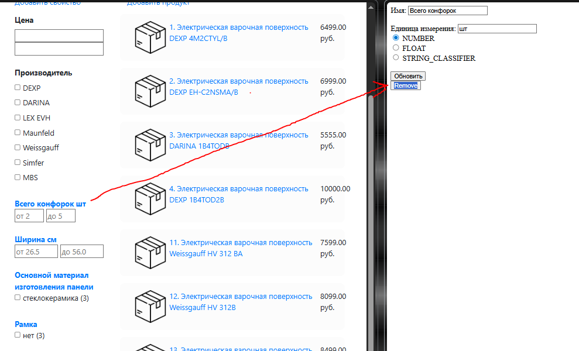
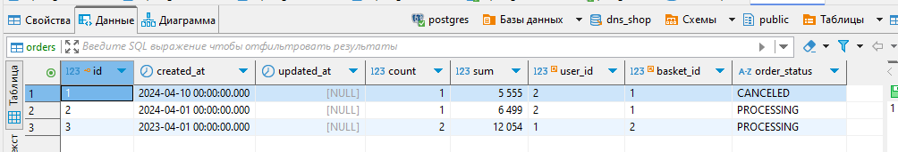
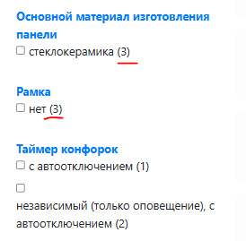
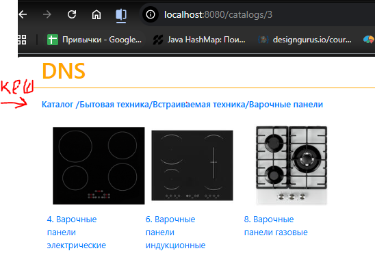

## Out of scope для DNS-Shop (первая итерация)

### Общее описание

DNS-Shop — это интернет-магазин с типичным для e-commerce функционалом:

*Пользовательская часть:*

* Просмотр каталога товаров (с фильтрацией по характеристикам)
* Регистрация и авторизация
* Добавление товаров в корзину
* Оформление заказов
* Просмотр истории заказов
* Редактирование профиля

*Административная часть:*

* Управление категориями товаров (создание иерархии)
* Управление свойствами товаров (EAV-модель)
* Добавление/редактирование товаров
* Управление справочниками (string_classifier)

*Ключевые особенности проекта (из кода и описания):*

| Особенность | Описание |
| :--- | :--- |
| **EAV-модель** | Товары имеют динамические характеристики (через таблицы property, product_property, string_classifier) |
| **Сложная фильтрация** | Реляционное деление + Criteria API + кастомный CPredicate |
| **Иерархические категории** | Дерево категорий произвольной вложенности (parent_id) |
| **Конкурентный доступ** | PESSIMISTIC_WRITE + @Version + сортировка ID для защиты от дедлоков |
| **Кэширование** | Hibernate 2nd level cache (Ehcache) для категорий и запросов |
| **Гибридный доступ** | JPA для CRUD, JDBC для аналитики (PropertyReadDtoExtractor) |
| **Безопасность** | Spring Security, роли USER/ADMIN, кастомный AuthenticationSuccessHandler |
| **Тестирование** | Testcontainers, JaCoCo (60% покрытие) |
| **Миграции** | Liquibase |

*Сущности БД:*
1. users — пользователи
2. category — категории (дерево)
3. producer — производители
4. product — товары
5. property — свойства товаров (EAV)
6. string_classifier — справочники для свойств
7. product_property — значения свойств для конкретных товаров
8. basket — корзины пользователей
9. basket_product — товары в корзине
10. orders — заказы
11. order_product — товары в заказе

### 1. Административная панель (оставляем в монолите)

**Почему:**

* Низкая нагрузка (админов мало)
* Меньше рисков — если админка временно упадет, пользователи не пострадают
* Сложная логика (EAV, управление свойствами) — проще оставить как есть на первом этапе

**Что именно:** CRUD категорий, товаров, характеристик.



### 2. История заказов (старые данные остаются в монолите)
  
**Почему:**

* Миграция миллионов заказов — сложная и рискованная
* Новые заказы пойдут в новый сервис, старые — читаем из монолита
* Можно реализовать паттерн "Strangler Fig" — постепенное замещение

**Что именно:** Старые заказы (до даты X) — остаются в БД монолита. Просмотр истории показывает заказы из двух источников (монолит + новый сервис)



### 3. Сложная аналитика (количество товаров в фильтрах)

* Это тяжелые запросы (JDBC + агрегация)
* Не критично для бизнеса (можно отключить временно)
* Требует отдельного решения (возможно, Elasticsearch позже)

**Что именно:** Подсчет количества товаров по каждому значению фильтра



### 4. Кэширование (Hibernate 2nd level cache)

**Почему:**

* В распределенной системе нужен распределенный кэш (Redis), а не Ehcache
* На первом этапе можно обойтись без кэша или с упрощенным решением

**Что именно:** L2 cache на сущностях и запросах (@QueryHints



### 5. Интеграции с внешними системами

**Почему:** В текущем проекте их нет. Если появятся позже, будут новым микросервисом.

**Что именно:**

* Платежные системы (не реализовано)
* Доставка (не реализовано)
* Email-уведомления (можно добавить позже)

### 6. Тестовая инфраструктура

**Что именно:** Testcontainers, JaCoCo - остаются в монолите. Для новых микросервисов будем писать тесты заново (с учетом их архитектуры)


### Что будет в первой версии микросервисов?

*На основе out of scope, в первую итерацию войдут:*

|Микросервис|	Функциональность|
| :--- | :--- |
|User Service|	Регистрация, аутентификация, профиль (частично)|
|Catalog Service|	Просмотр каталога, фильтрация (только для пользователей)|
|Basket Service|	Корзина (добавление/удаление товаров)|
|Order Service|	Оформление заказов (только новые)|

### Итог

> В первой итерации мы выносим только пользовательский путь: каталог, корзину, и оформление заказа.
> Это самая критичная и нагруженная часть.
> 
> Административная панель остается в монолите, у нее низкая нагрузка, меньше рисков при падении. Старые заказы также не будем переносить, будем просматривать из двух источников
> Отключаем аналитическую часть (количество товаров в фильтрах).


почему постгрис а не монго дб?

данные дублируются, запрос все товары для германии, в монго дебы для каждой страны хранит список товаров
в то время как каждый товар ссылается на свою страну

при этом легче менять название товара, не надо ходить по всем документом, меняется только  в одном месте join.
можно стлокнуться с проблемой ограничения документа для товаров.

Проблема 1: Дублирование данных
Если мы переименуем категорию "Сковороды и сотейники" → "Сковородки", нам нужно обновить каждый товар в этой категории! Потому что название категории хранится внутри каждого товара.
В PostgreSQL: обновили одну строку в таблице category — и все товары автоматически видят новое название через JOIN.

```json
// Коллекция products
{
    "_id": 1,
    "name": "Сковорода",
    "price": 1299,
    "category": {
        "id": 15,
        "name": "Сковорода",
        "parent": {
            "id": 14,
            "name": "Сковороды и сотейники",
            "parent": {
                "id": 13,
                "name": "Посуда и кухонные предметы"
            }
        }
    },
    "properties": [
        {"name": "Диаметр", "value": 28, "unit": "см"},
        {"name": "Материал покрытия", "value": "Антипригарное"}
    ]
}

```

Проблема 2: Добавление нового свойства
Добавили новое свойство "Ручка" для сковородок. Теперь нужно:

Обновить все существующие товары, чтобы у них появилось это свойство (с значением null или дефолтным)

Или при каждом чтении проверять, есть ли свойство, и если нет — подставлять дефолт

В PostgreSQL: добавили строку в property, и новые товары могут его использовать. Старые товары просто не имеют этого свойства (no rows in product_property).

транзакции есть операции которые нужно выполнять атомарно (сохранение в несколько таблиц, сброс кеша, отпрвка события, создание заказа с уменьшением количества товара)

нужна целостность - опредлеенные типы (инт для денег), ограничения -чеки - не меньше нуля, ссылки гарантирующие что родители существуют.


Итог по PostgreSQL vs MongoDB для каталога:
Аспект	PostgreSQL	MongoDB
Связи между сущностями	Естественные (JOIN)	Нужно денормализовать или делать несколько запросов
Изменение категории	UPDATE одной строки	UPDATE многих документов
Добавление свойства	INSERT в property	Нужно обновлять все товары или проверять при чтении
Рекурсивные запросы	CTE (один запрос)	Несколько запросов или денормализация path
Фильтрация по EAV	GROUP BY + HAVING (твой код)	Сложно, нужны индексы на каждый ключ


<table><thead><tr><th><span>Аспект</span></th><th><span>PostgreSQL</span></th><th><span>MongoDB</span></th></tr></thead><tbody><tr><td><strong><span>Связи между сущностями</span></strong></td><td><span>Естественные (JOIN)</span></td><td><span>Нужно денормализовать или делать несколько запросов</span></td></tr><tr><td><strong><span>Изменение категории</span></strong></td><td><span>UPDATE одной строки</span></td><td><span>UPDATE многих документов</span></td></tr><tr><td><strong><span>Добавление свойства</span></strong></td><td><span>INSERT в property</span></td><td><span>Нужно обновлять все товары или проверять при чтении</span></td></tr><tr><td><strong><span>Рекурсивные запросы</span></strong></td><td><span>CTE (один запрос)</span></td><td><span>Несколько запросов или денормализация path</span></td></tr><tr><td><strong><span>Фильтрация по EAV</span></strong></td><td><span>GROUP BY + HAVING (твой код)</span></td><td><span>Сложно, нужны индексы на каждый ключ</span></td></tr></tbody></table>


https://www.drawio.com/blog/c4-modelling

## Вы затронули фундаментальные различия между реляционным (PostgreSQL) и документоориентированным (MongoDB) подходами.
Давайте разберем ваши пункты более детально, чтобы подтвердить их правильность и добавить немного технического контекста.
1. Дублирование данных и нормализация
   Ваше утверждение верно: PostgreSQL принуждает к нормализации, а MongoDB часто провоцирует денормализацию.
   PostgreSQL: Вы создаете таблицу countries и таблицу products. В товаре хранится только country_id. Это экономит место и, что важнее, исключает аномалии обновления (если название страны изменится, вы меняете его в одном месте).
   MongoDB: Чтобы запрос «все товары для Германии» был мгновенным, разработчики часто встраивают данные. Если вы храните список товаров внутри документа страны, вы столкнетесь с проблемой ограничения размера документа (16 МБ). Если товаров тысячи, они просто не влезут в один объект «Германия».
2. Транзакции и атомарность
   Здесь есть важный нюанс. MongoDB ввела поддержку многодокументных транзакций (с версии 4.0), но PostgreSQL справляется с ними эффективнее «из коробки».
   Сброс кеша и отправка событий: Строго говоря, база данных сама не сбрасывает внешний кеш (например, Redis) и не отправляет события в очередь (RabbitMQ) в рамках своей транзакции. Однако в Postgres есть Transactional Outbox Pattern и логическая репликация, которые позволяют гарантировать, что событие будет отправлено только если транзакция в базе прошла успешно.
   Сложные связи: В Postgres гораздо проще гарантировать, что если вы создали «Заказ», то «Остатки на складе» уменьшились атомарно.
3. Целостность и типы данных
   Это сильнейшая сторона PostgreSQL.
   Деньги: Использовать Int (хранение в копейках/центах) — отличная практика. В Postgres также есть тип NUMERIC, который идеально подходит для финансов, так как исключает ошибки округления, свойственные числам с плавающей точкой (float).
   Constraints (Ограничения):
   CHECK (price > 0) — база просто не примет некорректные данные.
   FOREIGN KEY — гарантирует, что вы не привяжете товар к несуществующей стране.
   Схема: В MongoDB схема гибкая (Schema-less). Это удобно на старте, но через год разработки в одной коллекции могут лежать документы с разными именами полей, что превращает поддержку кода в кошмар.
   Сравнение в таблице
   Критерий	PostgreSQL	MongoDB
   Структура	Строгая (Schema-on-write)	Гибкая (Schema-on-read)
   Связи	Мощные JOIN, Foreign Keys	$lookup (медленнее и сложнее)
   Целостность	Гарантирована на уровне БД	Ложится на плечи разработчика
   Масштабирование	Вертикальное (сложнее горизонтально)	Горизонтальное (шардинг из коробки)
   Резюме
   Ваши аргументы абсолютно верны для систем, где:
   Данные имеют четкую структуру.
   Важна финансовая точность.
   Связи между объектами сложные (много ко многим, иерархии).
   MongoDB лучше выбирать, когда у вас огромные потоки неструктурированных данных (например, логи, сенсоры) или когда формат данных меняется каждый день и вам некогда описывать миграции.


Подход	Суть	Пример
По бизнес-способностям	Один микросервис — одна функция, которой пользуются другие сервисы	Сервис платежей, Сервис уведомлений, Сервис генерации PDF
По доменам (Bounded Context)	Один микросервис — вся логика для одной бизнес-области	Catalog Service (категории + товары + свойства + фильтрация)

Один ис плюсов отсутствие аномалий, я могу любому типу на любоом уровне, добавить свойство и он автоматически, появится у всех товаров, легко редактирую
типо безопасность, все нужные

"Я изучил возможность перехода на JSONB. Основные плюсы — упрощение фильтрации и меньше JOIN.
Но в моем проекте есть критичные требования, которые JSONB не закрывает:
Справочники (STRING_CLASSIFIER) с предопределенными значениями
Необходимость массового обновления свойств (например, переименование)
Ссылочная целостность между товарами и свойствами
Строгая типизация значений (числа отдельно, строки отдельно)
EAV с реляционным делением — проверенное решение для таких задач. JSONB я бы рассматривал,
если бы свойства были уникальны для каждого товара и не переиспользовались.
В текущей модели EAV остается оптимальным выбором."

Если бы я перешел на JSONB, код стал бы проще для фильтрации и чтения — убрал бы Criteria API, CPredicate, все JOIN.
Но появились бы сложности с массовыми операциями: переименование свойства,
добавление нового свойства всем товарам, удаление — всё это требовало бы обхода всех товаров и массовых UPDATE.
Также потерял бы ссылочную целостность и строгую типизацию.
EAV дает гибкость администрирования (легко менять свойства) ценой сложности фильтрации. 
JSONB дает простоту фильтрации ценой сложности администрирования.
Для моего проекта, где админка активна (добавление/изменение свойств), EAV подходит лучше.

"Если я перейду на WebFlux в Catalog Service, то от JPA-сущностей придется отказаться. Вместо них будут простые POJO без связей, 
а все данные буду получать через R2DBC-запросы. JSONB отлично впишется в эту модель — все свойства товара в одном поле, без JOIN.
Фильтрацию буду делать через JSONB-операторы PostgreSQL. 
Это даст неблокирующую обработку и потоковую выдачу результатов, но потребует переписать репозитории и сервисы."

Что можно сохранить:
✅ CPredicate — можно переделать под генерацию JSONB-фильтров
✅ Логику фильтрации — только вместо Criteria API будет построение JSON
✅ DTO и мапперы

Что придется переписать:
❌ Все Entity (убрать связи, добавить JSONB)
❌ Репозитории (JPA → R2DBC)
❌ Транзакции (будут короче и явные)
❌ Сервисы (вместо List → Flux/Mono)

Аспект	JPA (сейчас)	WebFlux + R2DBC + JSONB
Сущности	Есть, со связями	Только таблицы, без связей
Запросы	JPQL, Criteria API	Нативный SQL, R2DBC
Фильтрация	CPredicate + GROUP BY	JSONB-операторы (@>)
Производительность	Блокирующие потоки	Неблокирующие
Память	Загружает всё сразу	Потоковая обработка
Сложность кода	Высокая (EAV)	Средняя (JSONB)
Транзакции	Длинные	Короткие